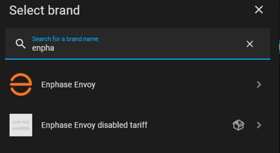
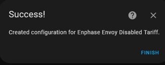
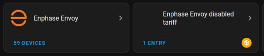
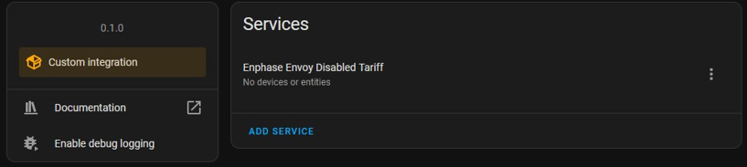

# ha_enphase_envoy_disable_tariff

When installed in Home Assistant together with enphase_envoy core, disables collecting tariff data for Enphase Envoy Stndard (not-metered) type.

This is a HACS custom integration to test disabling tariff data for the [Home Assistant Core Enphase Envoy integration](https://www.home-assistant.io/integrations/enphase_envoy) for [enphase envoys/IQ Gateways](https://enphase.com/en-us/products-and-services/envoy-and-combiner) Standard (not-metered) version.

This custom integration is NOT a replacement for the HA Enphase Envoy integration. You still need to configure the HA Enphase Envoy integration to communicate with any Envoy type. This custom integration disables the tariff updater for [pyenphase](https://github.com/pyenphase/pyenphase), which is the communication module used by HA Enphase Envoy. Once this updater is registered, the Envoy endpoint admin/lib/tariff is not collected by the HA Core Enphase Envoy integration.

You should only deploy this custom integration when running an Enphase Envoy S Stndard (not-metered) model which is showing regular connection losses. Do NOT use this with Enphase Envoy metered types. To recognize if this is applicable for your type, enable debug on the Enphase_envoy integration and inspect the log file. It should only collect data from

- V1 Production: Requesting https://<some_ip>/api/v1/production
- V1 inverters: Requesting https://<some_ip>/api/v1/production/inverters
- Tariff: Requesting https://<some_ip>/admin/lib/tariff

If only these endpoints are requested and regular connection issues are observed, try this custom integration that disables the collection of the Tariff endpoint.

This custom integration is only intended to validate if not collecting the Tarif endpoint for Enphase Envoy Standard (not-metered) solves the connectivity issues. Data from the Tariff endpoint is not used for this model anyway as it requires more data which is not available on this model.

Only use with Home Assistant 2023.12 or newer.

## Installation

1. Make appropriate backups of your Home Assistant installation and data.
2. Install [HACS](https://hacs.xyz/) if you haven't already
3. Add this GITHUB repository as a [custom integration repository](https://hacs.xyz/docs/faq/custom_repositories) in HACS
4. Restart Home Assistant
5. Go to the HACS Integrations page in HA, select this custom repository and download the `Enphase Envoy Standard disabled Tariff` custom integration
6. After download restart Home Assistant.
7. Add the custom integration using the home assistant configuration flow and select the `Enphase Envoy Standard disabled Tariff' integration
8. Restart Home Assistant to let the `Enphase Envoy disabled Tariff` remove the Tariff endpoint before `Enphase Envoy integration` starts

If you decide to install this manually without the use of HACS, then make sure to only place the files in custom_components/enphase_envoy_disabled_tariff from this repository into the folder /config/custom_components/enphase_envoy_disabled_tariff on your Home Assistant system.

## Usage

This custom integration is only intended to validate if not collecting the Tarif endpoint for Enphase Envoy Standard (not-metered) solves the connectivity issues. By the time you read this the issue may have been solved already in the core integration. Only install when receiving directions from the integration owners to do so.

Once the custom integration is added, no further configuration is needed for this custom integration. All setup of the Envoy is to be done in the HA Core Enphase Envoy integration.

This custom integration or the HA Core Enphase Envoy integration can be added in any order, but as long as this custom integration is not added, HA Core Enphase Envoy will collect the Tariff endpoint.

This custom integration only works with the Home Assistant Enphae Envoy core integration, not with other custom integrations for Enphase Envoy.

## Add the integration

Once the custom integration is added to your system using HACS, configure it as described in [Adding Integrations](https://www.home-assistant.io/getting-started/integration/). Search for `enphase` and select `Enphase Envoy disabled Tariff`

There is no further configuration information needed and the integration is created.

The newly added custom integrations shows in the integrations dashboard

In the integration details it shows as a service. The `add service` button will not add any more services. Only 1 can be added and is sufficient.

Now restart Home Assistant so the new integration can remove the Tariff updater before the core Enphase Envoy integration starts.

